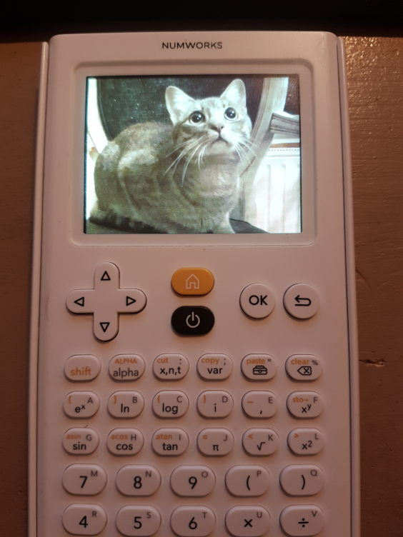

# nw-image-viewer

An image viewer for the numworks calculator

    
    

Omega is needed : https://getomega.dev/

Usage : 
- Python 3 required with Pillow, colormap & opencv-python.
- Images (in **"d_img"**) must be 320x240px in RGB 8bpc, and numbered as in the example (0-XX).
- Use **"wnt3-3.py"** to generate the **".bin"** file in the **"img"** folder.
- **"nw-img-vw"** allows you to display pictures, short videos/animations and black & white video like **"Bad Apple"**, you can secure some of them with a pin code.
- In app, use "menu" button to exit/go back, use arrows/cross to navigate and use "Ok" button to display the picture, use "Back" button to return to the list of pictures.

To build and use you will need : 
- First of all, follow **step 1** [here](https://www.numworks.com/resources/engineering/software/build/). (on Windows add [dfu-util](http://dfu-util.sourceforge.net/) to Msys2)
- Then set up : https://github.com/Omega-Numworks/Omega-External, 
and integrate **"nw-img-vw"** (don't forget to integrate your **".bin"** files to your package).

Credits : M4xi1m3 for [nw-badapple](/https://github.com/M4xi1m3/nw-badapple) released under a [MIT License](https://github.com/M4xi1m3/nw-badapple/blob/master/LICENSE). (base to the black & white video encoder/decoder)